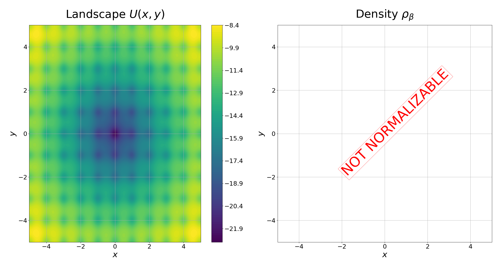
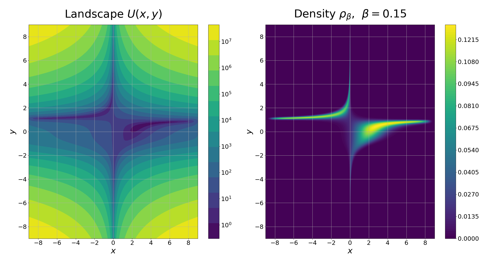
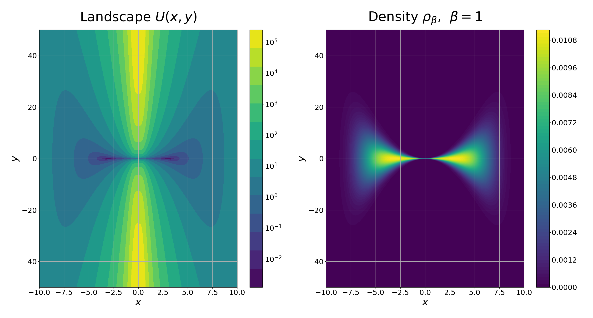
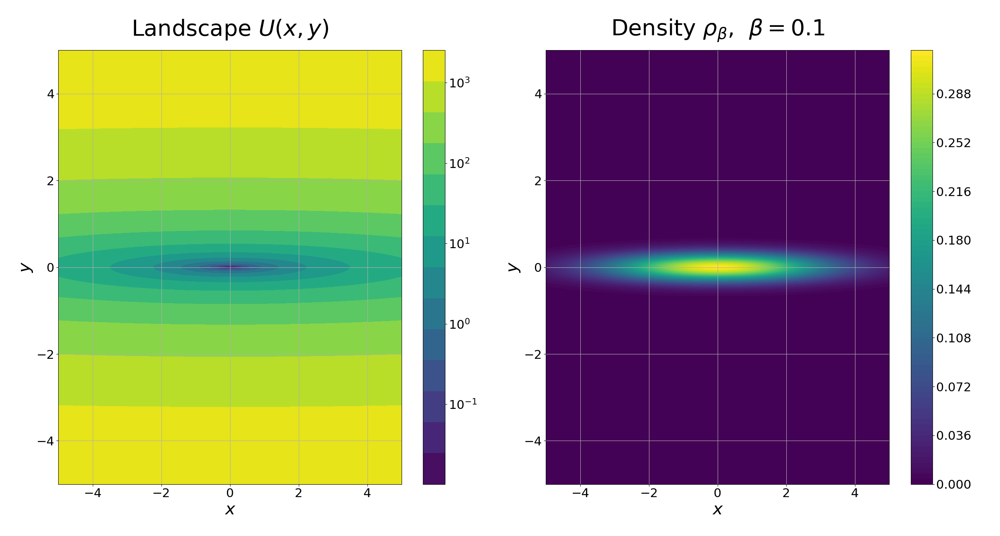
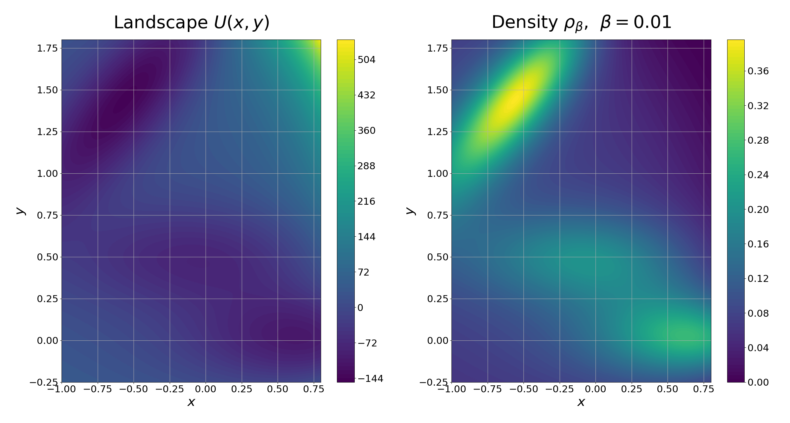
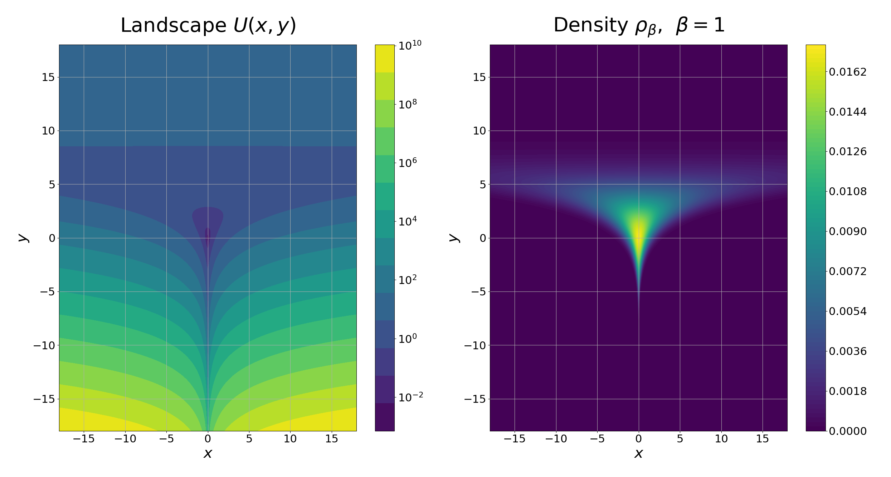
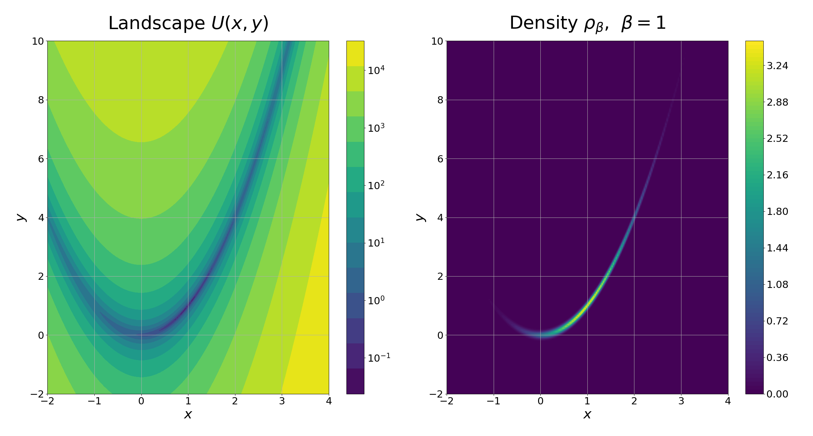
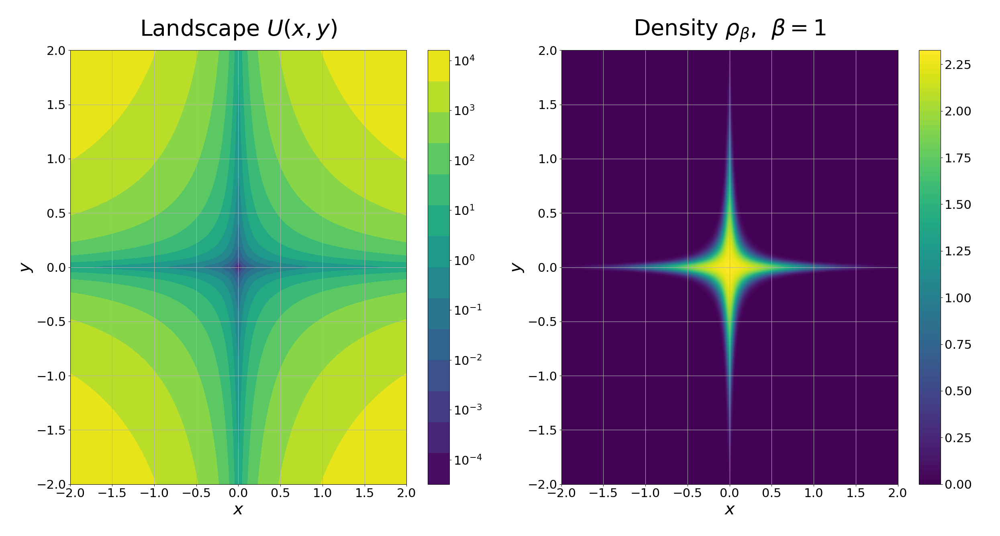

# SamplingSuite2D
This repository holds the source code of the SamplingSuite2D, which aims at sampling 2-dimensional surfaces using Langevin Dynamics-based integrators in a highly efficient and extensible framework.

The code can be compiled from source, executed from the command line, and run on arbitrarily many processes thanks to the Message-Passing Interface (MPI).
The behavior of the simulation (what problem and integrator to run, hyperparameters like stepsize and temperature, as well as the averaging behavior) 
can be controlled via various flags (see below).

The program prints out a simple .csv file holding time series data to various observables.

It can be easily modified in terms of adding new potentials, observables, and even samplers.

# Table of Content
- [SamplingSuite2D](#samplingsuite2d)
  - [Compile](#compile)
  - [Run](#run)
  - [Averaging Behavior](#averaging-behavior)
    - [No averaging](#no-averaging)
    - [Trajectory average](#trajectory-average)
    - [Time average](#time-average)
  - [Implemented Potentials](#implemented-potentials)
    - [Ackley](#ackley)
    - [Beale](#beale)
    - [Entropic Barrier](#entropic-barrier)
    - [Harmonic Oscillator (Asymmetric)](#harmonic-oscillator-asymmetric)
    - [Mueller-Brown](#mueller-brown)
    - [Neal](#neals-funnel)
    - [Rosenbrock](#rosenbrock)
    - [Star](#star-potential)
  - [How to add new potentials](#how-to-add-new-potentials)
  - [Observables](#observables)
    - [Change observables to collect](#change-observables-to-collect)
  - [Implemented Samplers](#implemented-samplers)
    - [How to add new samplers](#how-to-add-new-samplers)


## Compile
You need to be able to compile MPI-based C++ programs.
Download the files in the `/src` folder (or clone the repo). On Linux, using the Gnu Compiler Collection (gcc) with the MPI implementation provided by OpenMPI, compilation is invoked
via `mpicxx -O3 -o SamplingSuite2D main.cpp`.

If you receive errors such as `a space is required between consecutive right angle brackets`, it indicates that you compile against a C++ standard that is too old. In that case, try to add the compiler flag `-std=c++17`.

Successful compilation creates the executable `SamplingSuite2D`.

## Run
To run the simulation use `mpirun -n <num_processes> SamplingSuite2D [OPTIONS]` where `<num_processes>` should be replaced with the number of processes desired.
Each process will run an independent trajectory. The options are specified via ```--option_name arg```, e.g., `--stepsize 0.01`.  
Full list of options:  

| Flag           | Type       | Description      |
|----------------|------------|------------------|
| --sampler arg  |  string    | Sampler to use (see below).  |
| --stepsize arg |  float > 0 | Stepsize used by sampler. |
| --temperature arg | float > 0 | Temperature used by sampler.|
| --friction arg |  float > 0   | Friction used by sampler.|
| --alpha1 arg   |  float > 0   | Alpha1 hyperparameter used only by ZBAOABZ.|
| --alpha2 arg   |  float > 0   | Alpha2 hyperparameter used only by ZBAOABZ.|
| --sundman_m arg|  float > 0   | m hyperparameter used only by ZBAOABZ.|
| --sundman_M arg|  float > 0   | M hyperparameter used only by ZBAOABZ.|
| --forcefield arg | string   | Forcefield / potential to use (see below).|
| --init_position arg | two comma-separated floats | Initial position of the trajectories.|
| --init_velocity arg | two comma-separated floats | Initial velocity of the trajectories.|
| --N_iteration arg | int > 0      | Number of integrator steps.|
| --t_meas arg  | int > 0 | Integrator steps between two measurements (see below).|
| --n_meas arg  | int > 0 | Print any `n_meas` taken measurements to file (see below).|
| --burnin arg  | int > 0 | Start taking measurements only after `burnin` iterations.|
| --seed   arg  | int > 0 | Randomseed to instantiate RNG.|
| --output_name arg | string | Name of the printed output file.|
| --time_average | bool | If passed, trajectories will be time-averaged (see below).|

Note that all options are optional and have default values. Run `./SamplingSuite2D --help` for more information.

Note that the user is responsible for choosing admissible initial conditions (e.g., don't start in a forcefield singularity) and pick meaningful hyperparameters (e.g., don't use negative temperatures). 

## Averaging Behavior
There are several modes of possible averaging behaviors:
### No averaging
If you want to draw a single trajectory and take observable measurements along the way without any kind of average, run the code with only one MPI process and do not pass the `time_average` flag.
### Trajectory average
If you want to average results over multiple independent trajectories, run the code with multiple MPI processes. The output file will then contain the inter-trajectory averages.
### Time average
If you want the trajectories to be time-averaged (in terms of a moving average along the given trajectory), pass the `time_average` flag (without argument). The output file will then contain time-averaged observables.
The time average behavior can be fine-controlled with the `t_meas` flag. The observables will be measured any `t_meas` iterations and added to the moving average. 
Whether the moving average will be printed to the output file at each of these time points also depends on the flag `n_dist`. Only any `n_dist` times the moving average was updated will it be printed to output (that way, the accuracy of the moving average can be increased without increasing the size of the output file). In case of no time averaging, `n_dist` should simply remain `1` (the default value).


## Implemented Potentials 
The potential $U(x,y)$ to sample is governed by passing the `--forcefield` flag with an admissible argument (e.g., `--forcefield ackley` for the Ackley potential).
For a list of shipped potentials, run `./SamplingSuite2D --help`. 
 
Note that some of these potentials do not lead to normalizable densities $\propto e^{-\beta U(x,y)}$. These landscapes can still be of interest to test optimizers or examine trapping or rare-event transitions.

### Ackley
`forcefield --ackley`. 

The Ackley potential (not normalizable) is given by

$$U(x,y)=-20e^{-0.2 \sqrt{\frac{1}{2}(x^2+y^2)}} - e^{\frac{1}{2}\big(\cos(2\pi x)+\cos(2 \pi y)\big)}.$$

It has a minimum at $(0,0)$.



**Reference**:  
Ackley, D. H. (1987) **A connectionist machine for genetic hillclimbing**, Kluwer Academic Publishers, Boston MA. p. 13-14.

### Beale
`--forcefield beale`. 

The Beale potential is given by 

$$U(x,y)= (1.5-x+xy)^2 + (2.25-x+xy^2)^2 + (2.625-x+xy^3)^2.$$

It has a minimum at $(3,0.5)$. 

While the Beale function already leads to a normalizable density, we add an additional confining potential to the expression above, given by 

$$U_{\text{confining}}(x,y) = 0.3e^{10^{-5}(x^6+y^6)}. $$

Resulting potential: 



### Entropic Barrier
`--forcefield entropicbarrier`. 

This potential connects two valleys through a channel. The main sampling difficulty does not come from an energy barrier but from the narrowness of the channel. 

$$ U(x,y)= 100 \frac{y^2}{1+10x^4} + 0.001(x^2-9)^2. $$

It has two local minima at $(\pm 3,0)$ and is symmetric about the two axes.




### Harmonic Oscillator (asymmetric)
`--forcefield harmonic_asym`. 
  
A harmonic oscillator with different frequencies in the two dimensions. It has a unique minimum at $(0,0)$.

$$ U(x,y)=x^2 + 100 y^2. $$




### Mueller-Brown
`--forcefield muellerbrown`.

The Mueller-Brown potential is a famous model from computational chemistry for rare events. It has one deep valley and an adjacent higher plateau which holds two additional shallow valleys. It has three local minima and two saddle points.

$$ U(x,y) = \sum_{k=1}^{4} A_k \exp \Big[ a_k(x-\bar{x}_k)^2 + b_k(x-\bar{x}_k)(y-\bar{y}_k)+c_k(y-\bar{y}_k)^2 \Big], $$ 
with 
$$
\begin{aligned}
A &= (-200, -100, -170, 15), \\
a &= (-1, -1, -6.5, 0.7), \\
b &= (0, 0, 11, 0.6), \\
c &= (-10, -10, -6.5, 0.7), \\
\bar{x} &= (1, 0, -0.5, -1), \\
\bar{y} &=(0, 0.5, 1.5).
\end{aligned}
$$




### Neal's Funnel
`--forcefield neal`.

An exponentially narrowing potential with a minimum at $(0,0)$.  

$$ U(x,y) = \frac{1}{2}x^2e^{-y} + \frac{1}{18}y^2.$$ 

 

**Reference**:  
R. Neal. **Slice Sampling**. Annals of statistics, 705 (2003). 


### Rosenbrock
`--forcefield rosenbrock`. 
  
The Rosenbrock potential is a famous landscape for optimization. It has a single minimum at $(1,1)$.

$$ U(x,y) = (1-x)^2 + 100 (y-x^2)^2. $$

 

**Reference**:  
Rosenbrock, H.H. (1960). **An automatic method for finding the greatest or least value of a function**. The Computer Journal. 3 (3): 175–184.


### Star
`--forcefield star`. 

$$ U(x,y)=x^2+(1+1000x^2)y^2. $$

Minimum at $(0,0)$.




## How to add new potentials
It is straightforward to add new 2D potentials to the codebase.
To see how it is done, open the `simulation.h` file and scroll down to the definitions of the force functions, e.g., `inline void Simulation:: compute_force_ackley()` for the Ackley force:
```c++
// Ackley
const double Ackley_2pi {2*M_PI};
double Ackley_distconst;
double Ackley_x, Ackley_y;

inline void Simulation:: compute_force_Ackley(){

    // Fill help constants.
    Ackley_x = params.position.x;
    Ackley_y = params.position.y;
    Ackley_distconst = sqrt(0.5*(Ackley_x*Ackley_x + Ackley_y*Ackley_y));
    
    // Compute force.
    params.force.x = -2*Ackley_x*exp(-0.2*Ackley_distconst)/Ackley_distconst 
                      - M_PI*sin(Ackley_2pi*Ackley_x)*exp(0.5*(cos(Ackley_2pi*Ackley_x)+cos(Ackley_2pi*Ackley_y)));
    
    params.force.y = -2*Ackley_y*exp(-0.2*Ackley_distconst)/Ackley_distconst 
                      - M_PI*sin(Ackley_2pi*Ackley_y)*exp(0.5*(cos(Ackley_2pi*Ackley_x)+cos(Ackley_2pi*Ackley_y)));

}

```
The variables defined before the force function definition are global and can be accessed from within the function body. They are help-variables to make computations in the force function more efficient. Their name should always start with the name of the potential, in this case `Ackley_`.
The name of the new force function is `compute_force_Ackley`. These naming patterns should be kept for any added force function.  
In the function body, we have access to the `params` object, which holds the positions, velocities, and force fields (their `x` and `y` coordinates) of the current simulation state.  
The `params.force.x` and `params.force.y` fields need to be updated with the forces, i.e. with the components of $-\nabla U(x,y)$ where $U$ is the 2D potential.

Once the new force function is written, it needs to be made known to the simulation class. Scroll up to the private members of the `Simulation` class and add the name of the new force routine to the others:
```c++
class Simulation{

    public:

        // code
            
    private:

        // other code

        void (Simulation::* compute_force)();
        void compute_force_MullerBrown();
        void compute_force_Ackley();       
        void compute_force_Rosenbrock();
        void compute_force_Beale();
        // add new force
}
```
In the constructor of the `Simulation` class, we need to add a line to the case distinction that picks the right force routine depending on the input parameters:
```c++
    // Specify 2D problem to sample:
    if (forcefield == "mullerbrown")     compute_force = &Simulation:: compute_force_MullerBrown;
    else if (forcefield == "ackley")     compute_force = &Simulation:: compute_force_Ackley;
    else if (forcefield == "rosenbrock") compute_force = &Simulation:: compute_force_Rosenbrock;
    else if (forcefield == "beale")      compute_force = &Simulation:: compute_force_Beale;
    // Add new force case here.
    else throw std:: invalid_argument( "\nInvalid forcefield argument! See --help.\n" );

```

Save the file changes and open the file `argparser.h` in order to modify the `--help` message so that it accurately informs the user of the forcefields available:
```c++
    // Define command line options.
    options.add_options()
        // code.     
    ("forcefield",      "Forcefield. Allowed values 'mullerbrown', 'ackley', 'rosenbrock' or 'beale'.",  cxxopts:: value <std:: string>()->default_value(_forcefield_default))    
        // code.
```
Add the name of the new forcefield to the string
```c++
"Forcefield. Allowed values 'mullerbrown', 'ackley', 'rosenbrock' or 'beale'."
```
**Note** that the spelling needs to be identical to the one you used in the `else if` statement in the constructor before. Save the file and recompile the code.

## Observables
The processing of observables is governed by the `measurement.h` file.  
Currently, 4 observables are stored: The $x$-coordinate, the $y$-coordinate, the kinetic temperature, and the configurational temperature. The resulting output file will hold time series data for these observables, with the first column holding the iteration counts.   
In case the sampler used is ZBAOABZ, it will automatically collect time series to three additional quantities: the adaptive stepsize `dt` (averaged as all the other observables), the unaveraged adaptive stepsize `dt`, and unaveraged $\zeta$ variable and print them as the last three columns of the output file. Even if averaging is activated, the last two of the three will **never** be averaged. In case of multiple trajectories, they will correspond to the first trajectory.

### Change observables to collect
To change the collected observables or add new ones, we need to modify the `take_measurement` routine of the `Measurement` class in the `measurement.h` file.
```c++
        void take_measurement(const parameters& params){

            /* ########### COMPUTE CURRENT OBSERVABLE VALUES FROM PARAMETERS #####################################
               The number of entries in vector "observables" must correspond to member variable "no_observables" set by the user
               in the constructor above. The reweighting for the adaptive schemes is done automatically by the "process_sample" routine. 
               The adaptive schemes will also automatically store the adaptive step size and the \zeta variable. */            
            observables[0] = params.position.x;	 // x-coordinate
            observables[1] = params.position.y;  // y-coordinate
            observables[2] = 0.5*(params.velocity.x*params.velocity.x + params.velocity.y*params.velocity.y);   // Tkin
            observables[3] = -0.5*(params.position.x*params.force.x + params.position.y*params.force.y);        // Tconf
            /*########################################################################*/

            /*################# ENTER NAMES OF OBSERVABLES (WILL BE HEADER OF OUTPUTFILE)####*/
            col_names[0] = "x";
            col_names[1] = "y";
            col_names[2] = "Tkin";
            col_names[3] = "Tconf";
            /*################################################################################*/

            process_sample(params);   // compute (reweighted) time average and stores results for later print-out.

            return;

        };
```
The `observables` vector can be filled with functions of the current simulation state given by the `params` object. If we want to add a new observable, for example the distance of the position to the origin, $\sqrt{x^2+y^2}$, we just need to add an additional line specifying that new observable:
```c++
            observables[0] = params.position.x;	 // x-coordinate
            observables[1] = params.position.y;  // y-coordinate
            observables[2] = 0.5*(params.velocity.x*params.velocity.x + params.velocity.y*params.velocity.y);   // Tkin
            observables[3] = -0.5*(params.position.x*params.force.x + params.position.y*params.force.y);        // Tconf
            observables[4] = sqrt(params.position.x*params.position.x+params.position.y*params.position.y);  // Our new observable.
```
We also need to add a new name for the observable:
```c++
            /*################# ENTER NAMES OF OBSERVABLES (WILL BE HEADER OF OUTPUTFILE)####*/
            col_names[0] = "x";
            col_names[1] = "y";
            col_names[2] = "Tkin";
            col_names[3] = "Tconf";
            col_names[4] = "Distance to origin"; // Our new name.
            /*################################################################################*/
```
Since the `observable` vector has grown, we need to adjust its size in the class constructor above, i.e. we need to change the part
```c++
            /*######## ENTER THE NUMBER OF OBSERVABLES TO COLLECT ############*/
            no_observables = 4; 
            /*################################################################*/
```
to
```c++
            /*######## ENTER THE NUMBER OF OBSERVABLES TO COLLECT ############*/
            no_observables = 5; 
            /*################################################################*/
```
Then save the file and recompile the code.

## Implemented Samplers
### BAOAB
`--sampler baoab`.  
The BAOAB integrator is a 5-step splitting scheme of weak second order and is known to be highly accurate for the computation of configurational observables. 
It is particularly accurate at larger frictions.  

The 5 partial steps that make up a whole integrator transition are given by:  
  
with $a_1:=\exp(-\gamma \Delta t)$,  $a_2:=\sqrt{\beta^{-1}(1-a_1^2)}$, and $R_n$ is a random vector for which each component is independently drawn from a standard normal distribution.  

**Reference**:  
B. Leimkuhler & C. Matthews. **Rational Construction of Stochastic Numerical Methods for Molecular Sampling**.  
Applied Mathematics Research eXpress (2012).

### ZBAOABZ
`--sampler zbaoabz`.
ZBAOABZ is an integrator for the SamAdams dynamics which corresponds to Langevin Dynamics with adaptive stepsizes. The stepsize $\Delta t$ is adjusted dependent on a 
moving average over the force norms $\Vert \nabla U(q_n)\Vert^2$, reducing the stepsize in areas of large forces and increasing it in areas of small forces.  
A single integrator step consists of two Z-steps wrapped around a conventional BAOAB transition. The Z-steps evolve an artifical variable $\zeta$ according to  

$$
\zeta_{n+\frac 1 2} = \rho \zeta_n + \frac {1} {\alpha} (1-\rho) g(q_n,p_n),
$$
with $\rho=\exp(-\alpha \frac {\Delta \tau} {2})$ and monitor function  

$$
g(q,p)=\Omega ^{-1} \Vert \nabla U(q)\Vert^2,
$$

with scaling factor $\Omega>0$.  
This dynamics computes a moving average over (the recent history) of the monitor function, where $\alpha$ governs how quickly the past is forgotten and $\Omega$ decides the overall magnitude of $\zeta$ for a given series of experienced forces.  
After a Z-step, the stepsize $\Delta t$ is adjusted according to  

$$
\Delta t = \psi(\zeta) \Delta \tau, 
$$

where $\Delta \tau$ is the base stepsize and the Sundman transform kernel $\psi(\zeta)$ corresponds to $\psi^{(1)}$ in the reference below. This ensures $\Delta t \in (m \Delta \tau, M \Delta \tau]$ with $0<m<M$. 
Once the new stepsize has been computed, a BAOAB transition at this stepsize is executed, followed by another Z-step.  

The hyperparameters $\alpha$, $\Omega$, $\Delta \tau$, $m$, and $M$ can be passed as command line flags, where one can often use the default values for $m$ and $M$. 

**Reference**:  
B. Leimkuhler, R. Lohmann, and P.A. Whalley. **A Langevin sampling algorithm inspired by the Adam optimizer**.  
ArXiv preprint [arxiv.org/abs/2504.18911](https://arxiv.org/abs/2504.18911) (2015).

### How to add new samplers
... to be continued

